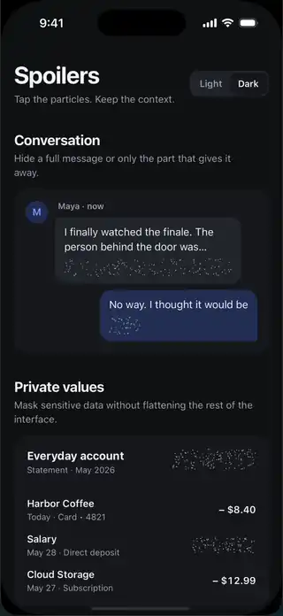

# react-native-spoiler-view

Telegram-style spoiler content for React Native, rendered with native particles.

<p align="center">
  
</p>

## Features

- Controlled and uncontrolled reveal state
- Touch-origin circular reveal
- Three particle depth/opacity tiers
- Hidden descendants are blocked from touch, VoiceOver, and TalkBack
- Runtime-safe configuration with bounded particle work
- Platform-native particle rendering on iOS and Android
- Shared Android ambient texture work instead of per-view simulation
- Core Animation ambient particles on iOS

## Compatibility

The package is maintained against two integration lanes:

| Lane | React Native | React | Reanimated | Gesture Handler |
| --- | --- | --- | --- | --- |
| Legacy | 0.73.x | 18.x | 3.15.5 | 2.18.x |
| Current | 0.86.x | 19.x | 4.5.x + Worklets 0.10.x | 3.x |

Reanimated 4 requires React Native's New Architecture and `react-native-worklets`. Select
dependency versions that support your React Native version rather than installing unrelated latest
majors.

## Installation

Install the component and the compatible native peers:

```bash
npm install react-native-spoiler-view \
  react-native-reanimated \
  react-native-gesture-handler
```

For Reanimated 4, also install Worklets:

```bash
npm install react-native-worklets
```

React Native Community CLI apps using Reanimated 4 must put the Worklets plugin last in
`babel.config.js`:

```js
module.exports = {
  presets: ['module:@react-native/babel-preset'],
  plugins: ['react-native-worklets/plugin'],
};
```

Wrap the application near its root with `GestureHandlerRootView`:

```tsx
import { GestureHandlerRootView } from 'react-native-gesture-handler';

export default function App() {
  return (
    <GestureHandlerRootView style={{ flex: 1 }}>
      <YourApp />
    </GestureHandlerRootView>
  );
}
```

Follow the native installation instructions for
[Reanimated](https://docs.swmansion.com/react-native-reanimated/docs/fundamentals/getting-started)
and [Gesture Handler](https://docs.swmansion.com/react-native-gesture-handler/docs/fundamentals/installation),
then run CocoaPods for iOS.

## Usage

### Uncontrolled

```tsx
import { Text } from 'react-native';
import { SpoilerView } from 'react-native-spoiler-view';

<SpoilerView accessibilityRevealLabel="Hidden message">
  <Text>This is a secret message.</Text>
</SpoilerView>;
```

The component owns its reveal state. Tapping toggles between hidden and revealed.

### Controlled

```tsx
const [revealed, setRevealed] = useState(false);

<SpoilerView
  revealed={revealed}
  onReveal={() => setRevealed(true)}
  onHide={() => setRevealed(false)}
  accessibilityRevealLabel="Hidden account number"
>
  <Text>1234 5678 9012 3456</Text>
</SpoilerView>;
```

In controlled mode, callbacks request a state change. The component animates only when the
`revealed` prop changes, so a parent may accept or reject the request without visual desynchronization.

### Custom particles

```tsx
<SpoilerView
  config={{
    particleCount: 300,
    particleColor: 'rgba(255, 100, 100, 1)',
    particleSizeRange: [0.5, 1.5],
    revealDuration: 400,
  }}
>
  <Image source={secretImage} />
</SpoilerView>
```

## Props

| Prop | Type | Default | Description |
| --- | --- | --- | --- |
| `children` | `ReactNode` | required | Content hidden by the spoiler |
| `revealed` | `boolean` | uncontrolled | Parent-owned reveal state |
| `enabled` | `boolean` | `true` | Enables reveal/hide gestures |
| `onReveal` | `() => void` | — | Reveal request callback |
| `onHide` | `() => void` | — | Hide request callback |
| `config` | `Partial<SpoilerConfig>` | — | Particle and animation overrides |
| `style` | `StyleProp<ViewStyle>` | — | Container style |
| `accessibilityRevealLabel` | `string` | `Hidden content` | Label announced while hidden |
| `accessibilityRevealHint` | `string` | `Double tap to reveal` | Reveal action hint |
| `accessibilityHideLabel` | `string` | `Hide content` | Action label exposed while revealed |
| `accessibilityHideHint` | `string` | `Double tap to hide` | Hide action hint |

## Configuration

```tsx
interface SpoilerConfig {
  particleCount: number;                // Default target/cap 180; maximum 1000
  particleDensity?: number;             // Default 0.055 per logical px², capped at 1000 total
  particleSizeRange: [number, number];  // Default [0.45, 0.8]
  particleColor: string;                // Default rgba(80, 80, 80, 1)
  overlayColor: string;                 // Default transparent
  noiseSpeed: number;                   // Ambient motion speed, default 0.3
  driftAmount: number;                  // Maximum ambient drift, default 1
  revealDuration: number;               // Default 500 ms
}
```

Unsafe numeric inputs are normalized at runtime. Particle work is always capped by
`MAX_PARTICLE_COUNT`, which is exported for consumers that expose configuration controls.
Providing `particleCount` without `particleDensity` opts into a fixed target. With density,
`particleCount` is the per-view cap, keeping the canonical dust adaptive without allowing a
large spoiler to monopolize the frame budget.

## Development

```bash
npm install
npm run check
```

The [`example`](./example) application is the maintained iOS and Android integration harness.

## License

MIT
