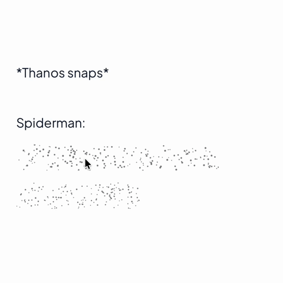
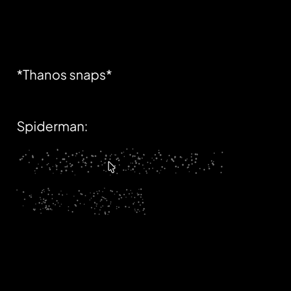

# react-native-spoiler-view

Telegram-style spoiler effect for React Native. Hide sensitive content behind animated particles that burst away on tap.

<p align="center">
  
  
</p>

## Features

- Tap to reveal with particle burst from touch point
- Smooth 60fps Skia-powered animations
- Fully customizable (colors, particle count, speed)
- Works on iOS and Android
- Controlled and uncontrolled modes

## Installation

```bash
npm install react-native-spoiler-view
# or
yarn add react-native-spoiler-view
```

### Peer Dependencies

This library requires these peer dependencies:

```bash
npm install @shopify/react-native-skia react-native-reanimated react-native-gesture-handler
```

Follow the installation guides for each:
- [@shopify/react-native-skia](https://shopify.github.io/react-native-skia/docs/getting-started/installation)
- [react-native-reanimated](https://docs.swmansion.com/react-native-reanimated/docs/fundamentals/getting-started)
- [react-native-gesture-handler](https://docs.swmansion.com/react-native-gesture-handler/docs/fundamentals/installation)

## Usage

### Basic (Uncontrolled)

Tap to reveal, tap again to hide:

```tsx
import { SpoilerView } from 'react-native-spoiler-view';

<SpoilerView>
  <Text>This is a secret message!</Text>
</SpoilerView>
```

### Controlled Mode

Control reveal state externally:

```tsx
const [revealed, setRevealed] = useState(false);

<SpoilerView
  revealed={revealed}
  onReveal={() => setRevealed(true)}
>
  <Text>Hidden until revealed</Text>
</SpoilerView>

<Button title="Reveal" onPress={() => setRevealed(true)} />
```

### Custom Styling

```tsx
<SpoilerView
  config={{
    particleCount: 300,
    particleColor: 'rgba(255, 100, 100, 1)',
    particleSizeRange: [0.5, 1.5],
    revealDuration: 400,
    burstSpeed: 200,
  }}
>
  <Image source={secretImage} />
</SpoilerView>
```

## Props

| Prop | Type | Default | Description |
|------|------|---------|-------------|
| `children` | `ReactNode` | required | Content to hide |
| `revealed` | `boolean` | `undefined` | Controlled reveal state |
| `enabled` | `boolean` | `true` | Enable tap gesture |
| `onReveal` | `() => void` | - | Called when revealed |
| `onHide` | `() => void` | - | Called when hidden |
| `config` | `Partial<SpoilerConfig>` | - | Customize appearance |
| `style` | `ViewStyle` | - | Container style |

## Config Options

```tsx
interface SpoilerConfig {
  particleCount: number;      // Number of particles (default: 200)
  particleDensity?: number;   // Particles per px² (overrides count)
  particleSizeRange: [number, number]; // [min, max] radius (default: [0.4, 0.9])
  particleColor: string;      // Particle color (default: 'rgba(80, 80, 80, 1)')
  overlayColor: string;       // Background overlay (default: 'transparent')
  revealDuration: number;     // Animation duration in ms (default: 600)
  burstSpeed: number;         // Particle burst speed (default: 150)
}
```

## How It Works

- Uses [@shopify/react-native-skia](https://shopify.github.io/react-native-skia/) for high-performance particle rendering
- Particles are rendered in a single batched draw call for optimal performance
- Animations run on the UI thread via [react-native-reanimated](https://docs.swmansion.com/react-native-reanimated/) worklets
- Tap gestures handled by [react-native-gesture-handler](https://docs.swmansion.com/react-native-gesture-handler/)

## License

MIT
